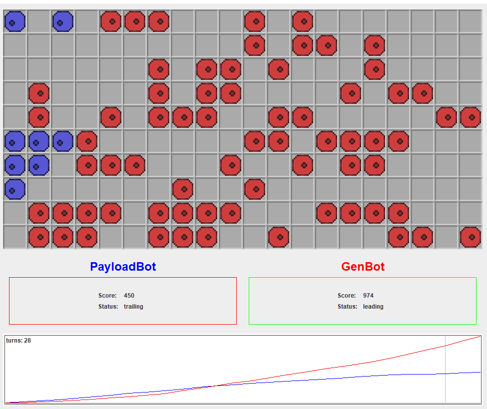
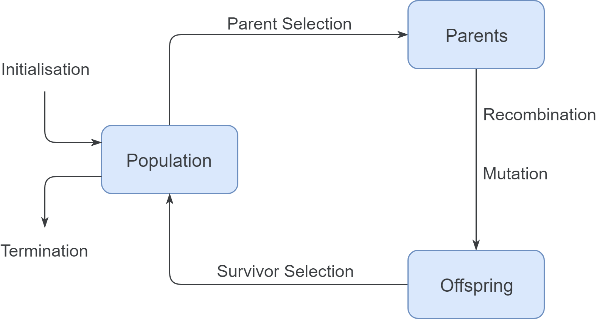

# Generative Algorithm in "Game of Life"

Implementation of a generative algorithm to play a competitive version of Conways  Game of Life.


#### Rules
* Two players place up to 5 cells every round alternating
* Game Duration: 200 rounds
* In each field without a living cell, a new cell is born if there are exactly 3 neighbours
* Neighbours are the 8 fields that border vertically, horizontally or diagonally
* Team of the new cell is the team that controls most of the neighbors
* If there is a tie (3 players, each a neighboring cell), no new cell is born
* Living cells die of loneliness if they have less than 2 neighbours of their own team
* Living cells die of overpopulation if they have more than 3 neighbors of any team
 



```
@incollection{michalewicz2004traditional,
  title={Traditional Methods—Part 1},
  author={Michalewicz, Zbigniew and Fogel, David B},
  booktitle={How to Solve It: Modern Heuristics},
  pages={55--81},
  year={2004},
  publisher={Springer}
}
```


#### Parameters
* Mutation Rate: 0.1
* Population: 100
* Max generations: 20
* Recursion depth: 10
    * Calculate 10 steps for the future to learn which pattern generate more cells as well as destroy pattern of the openent
* Crossover of the 33 best individuals
* Take 31 best
* 33  individuals with the lowest fitness die

### Requirements and Installation
* Java 10
* Run Main.java to start game
* GenBot will play against one random bot and 2 hardcoded bots